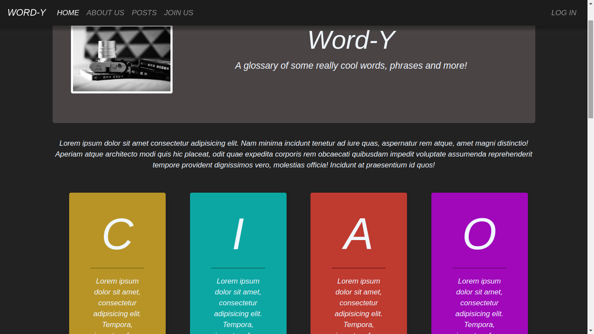

# WORD - Y

## About the project

### Project Description

It is a simple static website featuring a modern thesaurus loving community. It's built only using HTML and CSS and hence no functionality as such. 

### Project Tools / Components

The project comprises **5 html pages**, **5 css stylesheets**, **4 sass sheets** and **3 images taken from Unsplash**. I have implemented the nesting and inheritance features of SASS. I have also utilised Bootstrap-4 extensively.
